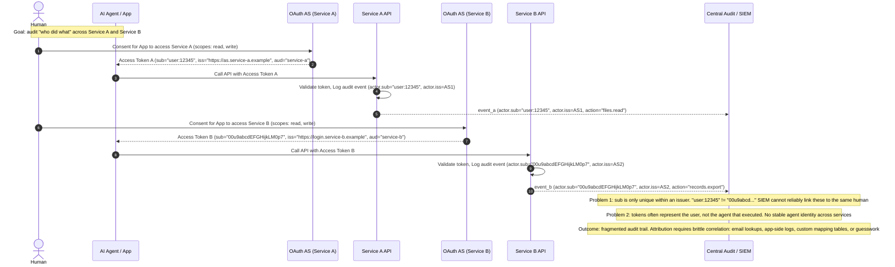

Most agent architectures today rely on authorization to let agents access applications on a human's behalf. This works because OAuth gives us a familiar, just-in-time browser flow where a human can make an explicit decision. It is a pragmatic choice. But as agents become more autonomous and less predictable, the lack of authentication for agents becomes the limiting factor in how secure modern systems can be.

Software agents are not new: we've been building autonomous agents for a long time now. AI agents are different because the logic that controls how an AI agent behaves is non-deterministic, and is typically an extension of human action. Chat interfaces paired with decision-making powerful enough to act on our behalf shift these systems closer to human actors than to structured programs with deterministic outputs. Delegation is a natural approach to first-line security.

You can see this most clearly in the security mechanisms we have built to control agents. MCP servers ship with OAuth as the primary layer for humans to authorize agents to access systems on their behalf. This choice is natural both structurally and as a user interface. The browser-based consent flow is something we already understand, and it gives humans a clear moment in the loop to approve access to confidential data or services.

But authorization is designed to connect one application to another within strictly defined scopes. Authorization solves a usability problem around human-mediated trust between deterministic systems. Instead of manually configuring trust between Calendly and Google Calendar, OAuth authorization allows Calendly to ask Google for access, prompts the user to approve a set of scopes, and, with a single click, establishes trust on both sides. It is elegant when you consider the alternatives that came before it.

This flow assumes a lot about the systems involved:
- Authorized client behavior is stable and constrained by predictable software
- Human consent is a reasonable proxy for future behavior, and approval implies long-term trust
- Scopes granted adequately match the intent of the authorized client
- Required capabilities are static, and do not evolve without a new authorization event
- The authorization server defines the oauth `subject`, and resource servers do not require strong guarantees about the client's identity

**AI agents break these assumptions.**

An AI agent is not a bounded client. Its behavior is not fixed at deploy time, and it is not constrained to a single, predictable execution path. Decisions are made at runtime, shaped by prompts, external context, retrieved data, and inference. A one-time human consent doesn’t account for future behavior when that behavior is adaptive by design. As a result, scopes stop being a useful approximation of intent. They describe what an agent can touch, but not why, when, or how that access will be exercised. As an agent's goals and reasoning shift in response to new context, the authority granted during authorization drifts further away from the behavior that occurs at execution time.

Authorization gives us familiar control and keeps a human in the loop. But it also pushes us toward a model where trust is inferred, identity is implied, and limits autonomous behavior. In this model, the subject of access is still the human. The agent is treated as a conduit, not as principal. A byproduct of this is that audit trails collapse back to the approving user or the subject that the authorization server defined. When something goes wrong, it’s impossible to attribute the problem to any particular agent that the human authorized.

**Authentication can fill these gaps**, but there are tradeoffs. 

Authentication gives us a way to treat agents as entities rather than just extensions of a human. With authentication, an agent can present an identity rooted in a trusted identity provider (or hardware), distinct from the human who created or authorized it. Access can then be granted based on who or what the agent is, not just what it has been allowed to access. This enables tighter, context-aware controls, and auditability that reflects the true actor in the system. It also allows trust to be established independently of a single authorization event, which matters when behavior is adaptive, long-lived, or requires fully autonomous execution.

Without authentication, we force adaptive, decision-making systems into security models built for static software. The result is weaker auditability and control at the exact moment systems begin acting on our behalf. 

In reality the authentication and authorization protocols that exist today aren’t adequate to securely handle agentic permissions and auditability. Because agents share attributes of both human and machine interaction modes, we need new systems that can combine the advantages of both authorization and authentication. These systems should let humans approve scoped actions that respect principles of least privilege, help that approval keep up with agentic speed and scale, and let auditors attribute actions to particular agents. 

**New standards and vision for identity are needed** to solve the gaps in authN and authZ for agents.

While none of these efforts are explicitly framed as “AI agent security,” both the IETF and W3C are actively evolving identity foundations in ways that map directly to the problems agentic systems expose.
Within the IETF, initiatives like [WIMSE](https://datatracker.ietf.org/group/wimse/documents/) and [SPICE](https://datatracker.ietf.org/wg/spice/about/) reflect an important shift: authentication is no longer assumed to begin with a human, an interactive session, or a static runtime. WIMSE explores headless, OIDC-based flows for machine identity, aligned with SPIFFE, allowing workloads to authenticate in dynamic environments without relying on user-bound tokens. SPICE pushes further, focusing on how software can present verifiable identity in distributed systems that are adaptive, ephemeral, and only partially controlled.

These efforts move us closer to a world where workloads and agents have explicit, auditable identities, but they still have tradeoffs: authentication establishes who or what is running, while authorization remains tightly coupled to centralized token minting and one-time consent decisions.

Looking ahead, W3C Verifiable Credentials offer a compelling vision to decouple these concerns. Using the [Verifiable Credentials Data Model 2.0](https://www.w3.org/TR/vc-data-model-2.0/), authentication becomes the act of proving possession of cryptographically verifiable claims about an agent’s identity, origin, and constraints. Credential validity can be continuously evaluated using standardized status mechanisms like the [Bitstring Status List](https://www.w3.org/TR/vc-bitstring-status-list/), allowing delegation to be revoked or modified after issuance. Agent identity can be bound to cryptographic keys using [Controlled Identifiers](https://www.w3.org/TR/cid-1.0/), and credentials can be securely exchanged using formats defined in [Securing Verifiable Credentials using JOSE and COSE](https://www.w3.org/TR/vc-jose-cose/).

In this hypothetical model, a human’s approval results in a verifiable delegation credential that can be continuously evaluated, updated, or revoked without re-running the original authorization flow. Agents present who they are and what they have been delegated to do; systems decide what to allow right now. Identity becomes portable, attestable, and independent of any single runtime, cloud provider, or authorization server. 

The long-term opportunity that exits me most is a **unified identity framework** that spans humans, agents, and workloads. One where identity is no longer fragmented across protocols and platforms, and where engineers and end users alike benefit from systems that are simpler, more auditable, and fundamentally more trustworthy.

## Sequence Diagrams / References

### Audit Challenges with Current AuthZ Model

